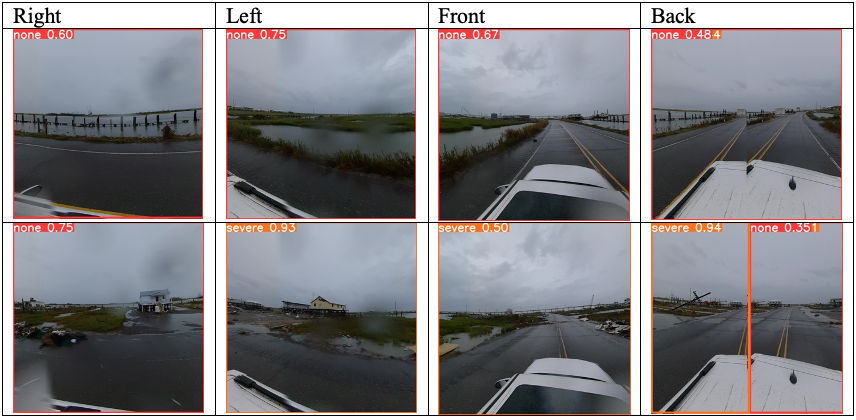

# Disaster Damage Detector - (DDDtect.org)

When disasters strike, it is of the utmost importance to quickly and accurately identify structures that have incurred significant damage. The purpose of this research project is to develop an automated real-time damage identification system (DDDtector) using a recursive software training process. To achieve the goals of this project, it was necessary to obtain both a suitable software package and enough data to allow the software to produce sufficiently accurate results. The researchers selected YOLOv5 (You Only Look Once) for the damage identification task, and they acquired images of the Ecuador earthquake of 2016 from Crisis Natural Language Processing (CNLP) and the Qatar Computing Research Institute at Hamed Bin Khalifa University (QCRI) (https://crisisnlp.qcri.org/).

## Design

The researchers needed a disaster with at least 1000 photos of post-event structures; the Ecuador earthquake of 2016 met this standard with 2280 recorded images. The Ecuador earthquake pictures were chosen over a photo set from Google Images because the Ecuador images were determined to be more uniform in their depictions of structural damage. After obtaining the Ecuador images from CNLP and QCRI, the researchers divided the data into three categories: training images (60%), validation images (20%), and test images (20%). Damage categories had to be defined before system training could commence, and they were labeled as follows: none, mild, and severe. FEMA itself uses four categories for damage classification (affected, minor, major, and destroyed) (https://www.fema.gov/sites/default/files/documents/fema_2021-pda-pocket-guide.pdf), but using just three categories for this project was more appropriate because it allowed the software to be trained for real-time detection more efficiently. As the detection mechanism is refined over time, it should be possible to add more damage categories without sacrificing accuracy.

### YOLOv5

YOLOv5 employs convolutional neural networks (CNNs) and region-based convolutional neural networks (RCNNs) to produce its results. The CNNs and R-CNNs in YOLOv5 are tailored for speed, and thus YOLOv5 was a suitable choice for real-time structural damage detection. Also, because YOLOv5 uses PyTorch (an open-source machine learning framework that facilitates research output), it is able to take better advantage of CUDA cores, resulting in greatly increased training performance over its predecessor, YOLOv4 (which was programmed in C) (https://docs.ultralytics.com/). For the training phase of the project, 1368 images of the Ecuador earthquake were entered into YOLOv5, and the remaining 912 images were set aside for validation and system testing. The images were sorted and labeled so that YOLOv5 could locate the images in their respective folders (training, validation, and test); the instructions for YOLOv5 were coded in Python. YOLOv5 is able to evaluate multiple structures in an image separately, but for this project the software was coded so that YOLOv5 would be trained with each image being a single instance of damage. As a result, the detection system in this project assigns one aggregate damage score for an entire image frame, which is useful for real-time detection using a moving camera.

## Training

During the training routine, detection accuracy was evaluated using the “intersection over union” method, which employs the ratio of an image’s proposed pixels to its actual pixels. The original intent was to run 1000 training epochs, but damage detection accuracy failed to show any significant improvements starting with epoch 130; processing was ultimately ended after epoch 230, when it was clear that no more improvements were going to emerge. After epoch 230, DDDtector was able to correctly identify 96.8% of the images displaying no damage, and its identification accuracy for the images showing severe structural damage was 85.4%. However, DDDtector’s accuracy for images with mild damage was significantly lower (less than 50%), meaning that the system had trouble identifying structures in intermediate states of disrepair. This is perhaps not surprising, but it does mean that DDDtector will have to undergo further training to be able to accurately distinguish between the three different categories of damage that are defined herein.

## Field Application

DDDtector was used to evaluate images and video from Hurricane Ida. These items were collected by NDPTC representative Dennis Hwang in 2021. With DDDtector we were able to detect damages from 360 photos. The result images are as follows. 

The detection was working in specific areas that we have trained with as flood damages but with limitations of image quality and possibly the lighting situation is not ideal for detection. Continuing with more publicly available data and reinforce training, we can have improvements of the detection confidences. 

